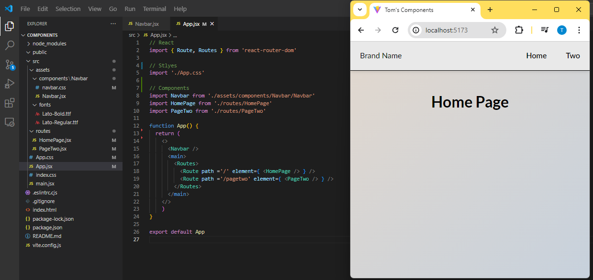

# Basic Vite App with routing
*By DevTomUK*  
[DevTomUK - Github](https://github.com/DevTomUK/)

## Contents:

This repo contains a simple Vite React App with a function to write to a Firestore Database with one click.  
Clone the repo to your account and add your own firebase API key to write to your own database.

## Quick App setup

Start building an app quickly with this basic template.  
This template comes with a basic Navbar and two Routes to start building on.  

File structure:  

## Installation:

### Fork the Repository:
- Go to the repository on GitHub and click on the "Fork" button to create a copy under your GitHub account.

### Clone the Repository:

- Clone the forked repository to your local machine by running the following commands in your terminal:

    git clone https://github.com/DevTomUK/ViteFirestore.git
    cd ViteFirestore
    npm i
    touch /src/config.js (type NUL > src\config.js in windows, or open the folder and create config.js in ./src)
    code .

- Go to config.js and add your firebaseConfig
